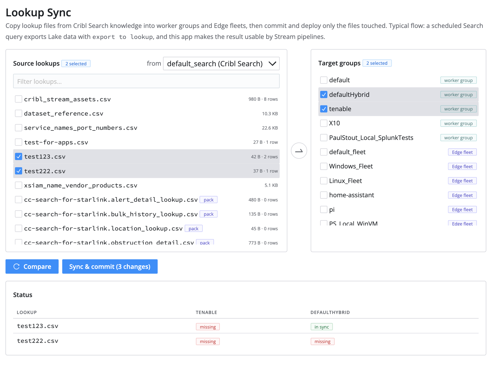
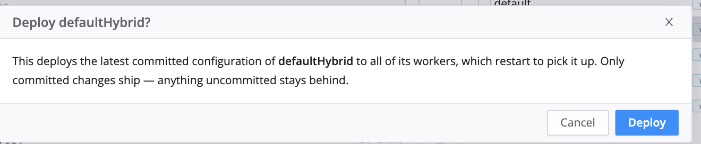
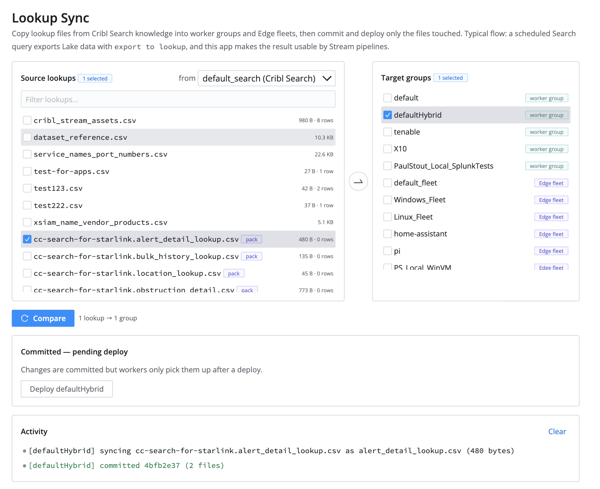

# Lookup Sync — a Cribl App

Sync lookup files from Cribl Search knowledge into Stream worker groups and
Edge fleets, right from the Cribl UI — byte-for-byte comparison, commits
scoped to only the files touched, and on-demand deploys.
**Completely credential-less**: every call runs on the signed-in user's
session via the platform's injected auth.

This is the Cribl App port of
[VisiCore/vct-cribl-lookup-sync](https://github.com/VisiCore/vct-cribl-lookup-sync),
which does the same job as a standalone Python script driven by cron or a
Script collector. The app keeps the script's careful semantics and drops all
of its operational baggage: no API credentials, no env files on worker
nodes, no Python — the sync engine is TypeScript inside the app.



## Why

You have data in Cribl Lake — asset inventory, threat intel, user/host
mappings — and want to reference it at ingest time in a Stream pipeline
(Lookup function, `C.Lookup()`). Stream can't query Lake, but Search can:

```
dataset="my_lake_dataset" earliest=-24h
| summarize count() by host, owner
| export to lookup host_owner.csv
```

That exported lookup lands **only in Search knowledge** (the `default_search`
group) — worker groups can't see it. This app closes the gap: it copies the
lookup into your worker groups, commits, and deploys, making it available to
pipelines. The same pattern works for anything Search can
`| export to lookup`, not just Lake data.

## What it does

**Compare** — pick lookups from a source group (default `default_search`) and
one or more target groups. The app fetches raw content from both sides and
shows a per-lookup × per-group status matrix: `in sync`, `out of date`,
`missing`, or `not syncable`. Lookup files a previous run uploaded but never
committed are detected via `version/status` and flagged.

**Sync & commit** — after an explicit confirmation listing exactly what will
be created or overwritten, changed lookups are uploaded (Cribl's two-step
content upload) and each group gets **one commit scoped to exactly the touched
lookup paths** (`data/lookups/<name>.csv` + `<name>.yml`). A colleague's
in-progress changes or post-upgrade `default/` churn are never swept into the
automated commit — and since deploy ships commits only, they stay out of the
deploy too.

**Deploy** — per-group button with its own confirmation. Nothing deploys
implicitly.



Selections persist in the app's KV store, all destructive operations require
explicit confirmation, and every run is logged in an activity panel.

**Scheduling is deliberately out of scope.** This app is for ad hoc syncs on
your own session. Cribl apps have no server side, so anything scheduled
would either only run while the app is open, or require stored API
credentials on a worker — if you need fully unattended syncs, use the
original
[script + scheduled collector](https://github.com/VisiCore/vct-cribl-lookup-sync)
approach instead; the two coexist fine.

## Requirements & installation

- Cribl 4.18.0+ (leader with the App platform enabled).
- Install the packaged app archive (`npm run package` → `build/*.tgz`) via
  your leader's Apps management page.
- At install time, admins see the app's full API surface in
  [`config/policies.yml`](config/policies.yml): lookups read/write, scoped
  version commits, and group listing/deploys. No external domains are used
  (`config/proxies.yml` is empty).
- **Zero credentials, anywhere.** The platform injects the signed-in user's
  auth into every API call the app makes. There is nothing to create, store,
  rotate, or leak: no API credentials, no secrets store entries, no files on
  worker nodes. The signed-in user needs rights to read Search knowledge and
  edit/commit/deploy the target groups.

## Pack lookups

Search lists lookups that live inside a pack as `<pack>.<file>.csv` (pack
notation). Target groups don't have that pack, so the pack-prefixed id is
unaddressable there (`500 Invalid context <pack>`). The app handles this the
same way the Cribl UI's "Move → All Lookups" does: pack lookups sync into
the target group's **global knowledge under their bare filename** —
`starlink.status_lookup.csv` arrives as `status_lookup.csv`, and that's the
name pipelines reference. These rows are tagged `pack` in the source list,
the status matrix shows the rename (`pack.name.csv → name.csv`), and the
compare step refuses selections where two pack lookups would collide on the
same bare name.



## Development

```bash
npm install
npm run dev       # Vite dev server for Cribl live preview
npm run build     # type-check + production build
npm run lint      # oxlint
npm run package   # build + installable archive in build/ (bumps version)
```

Built with React 19, TypeScript, Vite, and Cribl's
[Capra design system](https://capra.cribl.io). `src/api.ts` is the entire
Cribl REST surface; `src/App.tsx` is the UI. See `AGENTS.md` for the Cribl
App platform developer guide (fetch proxy, KV store, policies).

Implementation notes carried over from the original script:

- The `/content` endpoint answers HTTP 500 (not 404) for a missing lookup, so
  existence is probed on the object endpoint first.
- `raw=true` is required when reading content; without it the API returns
  parsed rows with an internal `__id` column.
- On PATCH of a lookup object, server-managed fields (`status`,
  `notifications`) are stripped before sending back.
- If a previous run uploaded or committed but died before deploying, the next
  compare/sync picks the staged files back up and commits them.
- Syncing never deletes anything: dropping a lookup from your selection
  leaves the target group's copy in place — clean those up from the group's
  Knowledge page.

## License

Apache License 2.0 — see [LICENSE](LICENSE).
